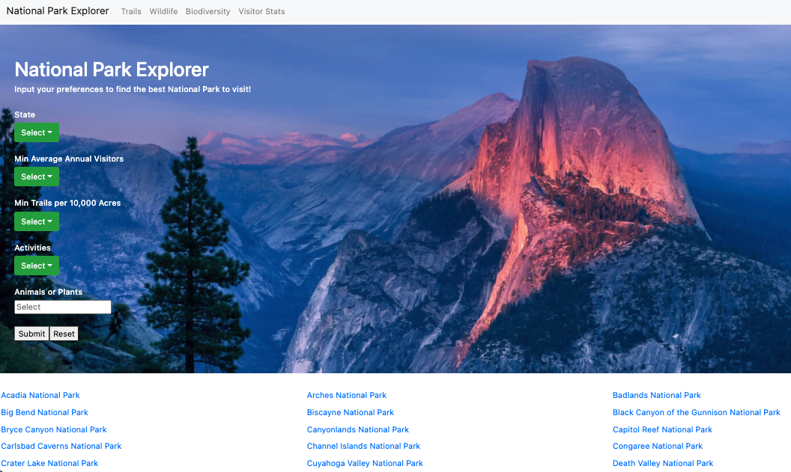

# NATIONAL PARK EXPLORER


## Authors
- Jacob Brinlee
- Dominic Insogna
- Jonathan Matsumoto
- Kevin Tyler

## Overview
National Park Explorer is a website designed to help outdoor enthusiasts better plan out their next adventure. Specifically, National Park Explorer focuses on the National Parks in the United States and centralizes information about the specific parks along with the respective hiking trails and wildlife within these parks. With a diverse array of features, users are able to use simple functions such as finding basic information about certain parks they may be interested in or delve into more advanced applications such as getting recommendations based on their interests and location. 

There are five main pages within the program. The home page allows a user to select a state, number of visitors, amount of trails, activities, and wildlife in order to narrow down their search of national parks. They can then use the links to these parks to be taken to an individual park page with basic information such as a summary of the park, the top 5 trails, and a list of endangered species in the park.

The second page - Trails - allows a user to search specific attributes of trails they may enjoy, such as difficulty and distance, and then see trails that fit this criteria and what national park they are in. The third page - Wildlife - allows a user to see all the animals of a certain class found within a given park. The fourth page - Biodiversity - allows a user to enter their zipcode and a distance, and it will calculate the two most biodiverse parks within this distance to the zipcode. Finally, the fifth page - Visitor Stats - allows a user to select a decade and see which parks were the most popular during that decade, as well as the average visitor count.

## Architecture
- Frontend: React/Javascript, HTML, CSS (including ```reactstrap``` library)
- Backend: Node.js, Express, AWS RDS MySQL Database

## Running the Project:
NOTE: The AWS credits for this project have currently expired. The project remains to show an example of a complete CRUD project created by the author.
- Clone the repo: ```git clone <main branch>```
- Install client dependencies
  - ```cd client```
  - ```npm install```
- Install server dependencies
  - ```cd ../server```
  - ```npm install```
- Start server
  - from server directory: ```npm start```
  - For dev mode: ```npm run devStart```
- start client: 
  - Open new terminal and navigate to client directory 
  - run: ```npm start```  
- Client runs on local port 3000; Server runs on local port 8081


## Datasets
For this project, we found several datasets on Kaggle and also collected information from an API designed by the National Park Service (NPS), which we downloaded, processed, and organized into sub-datasets to optimize query run times.
- Basic National Park Data: https://www.kaggle.com/nationalparkservice/park-biodiversity
- Biodiversity Data: https://www.kaggle.com/nationalparkservice/park-biodiversity
- Trails Data:  https://www.kaggle.com/planejane/national-park-trails
- National Park Service API Data: https://www.nps.gov/subjects/developer/api-documentation.htm
- Park Visitor Data: https://data.world/inform8n/us-national-parks-visitation-1904-2016-with-boundaries
- Location Data: https://public.opendatasoft.com/explore/dataset/us-zip-code-latitude-and-longitude/table/

